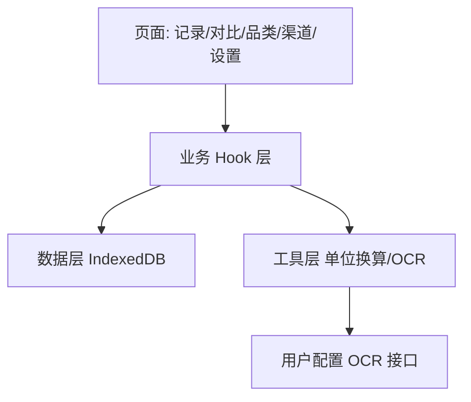

## 用户需求

买菜时记不住各菜市场/线上平台的肉菜价格，且售价单位有 kg 与斤之分需要换算，导致无法判断买贵买便宜。需要一个手机端价格记录与对比工具。

## 产品概述

一款手机 Web 应用（PWA，可添加到桌面），用于记录每次买菜的商品单价与购买渠道，统一换算为「每斤」价格，支持按商品名分组查看各渠道价格对比，帮助判断哪里买更便宜。数据本地存储，无需账号。

## 核心功能

- 手动输入单价：填写商品名、品类（预设+自定义）、单价金额、原始计价单位（kg/斤/克）、购买渠道、日期，自动换算并统一显示为每斤价格
- 拍照/图片识别单价：调用手机相机或相册选图，图片经用户配置的 OCR 接口识别文字后回填到输入表单（接口可配置，Key 留空则功能提示未配置）
- 价格记录列表：展示所有已记录的价格条目，支持按品类、渠道筛选与搜索，显示每斤换算价
- 价格对比：按商品名分组，列出同一商品在各购买渠道的每斤单价，标注最低价渠道
- 品类管理：预设肉、菜、水果、海鲜等常见品类，支持自定义新增品类标签
- 购买渠道管理：支持添加/选择常去的菜市场、超市、线上平台等渠道

## 技术栈选择

- 前端框架：React + TypeScript（组件化，适合 PWA 单页应用）
- 样式与组件：Tailwind CSS + shadcn/ui（美观、可访问、移动端友好）
- 构建/PWA：Vite + vite-plugin-pwa（生成 manifest 与 service worker，可添加到桌面、离线可用）
- 本地存储：浏览器 IndexedDB（通过 idb 库封装）存储价格记录、品类、渠道、用户 OCR 配置（Key 仅存本地，不联网上传）
- OCR：前端 fetch 用户配置的视觉识别接口（OpenAI 兼容 / 自定义端点），不硬编码供应商；未配置时禁用并提示

## 实现方案

- 采用 React + Vite 单页应用，以「记录」为核心数据实体，所有展示（列表、对比）均由记录集合派生，避免冗余状态。
- 单位换算集中在纯函数模块：`normalizeToJin(price, unit)` 将 kg/克/斤统一换算为每斤（1 kg = 2 斤，1 斤 = 500 克，1 克 = 0.002 斤），保证换算逻辑单一来源、易测试。
- OCR 识别结果为辅助回填，最终仍由用户确认并提交手动表单，避免识别错误直接入库。
- 本地存储用 IndexedDB 而非 localStorage，因记录可能较多且含图片缩略，IndexedDB 容量与结构化查询更合适。
- 性能：记录列表与对比均为前端内存计算，数据量（个人使用）百条级别，O(n) 分组即可；图片识别为异步，需 loading 态与错误兜底。

## 实现要点

- 复用 shadcn/ui 的 Dialog/Select/Input/Card/Table 等组件，保持 UI 一致；自定义移动端底部导航。
- OCR 调用需处理网络失败、接口返回异常，失败时回退到手动输入并提示。
- 用户 API Key 仅存于本机 IndexedDB，界面提供「设置」页填写，明文不展示、可清除；不向任何第三方上报。
- 拍照使用 `<input type="file" accept="image/*" capture="environment">` 在手机浏览器调用后置摄像头。

## 架构设计

- 分层：UI 组件层（页面与可复用组件） / 业务 Hook 层（useRecords、useCategories、useChannels、useOcr） / 数据层（db 封装 + 类型定义） / 工具层（单位换算、格式化）。
- 数据流：用户输入 → 业务 Hook 校验与换算 → 写入 IndexedDB → 列表/对比派生渲染。



## 目录结构

```
maicai/
├── index.html                      # [NEW] PWA 入口 HTML，含 meta viewport、theme-color、manifest 引用
├── package.json                    # [NEW] 依赖与脚本（react、vite、tailwind、shadcn、idb、vite-plugin-pwa）
├── vite.config.ts                 # [NEW] Vite + PWA 插件配置，注册 service worker
├── tsconfig.json                  # [NEW] TypeScript 配置
├── tailwind.config.js             # [NEW] Tailwind 配置
├── postcss.config.js              # [NEW] PostCSS 配置
├── public/
│   └── manifest.webmanifest       # [NEW] PWA manifest（名称、图标、display standalone）
├── src/
│   ├── main.tsx                   # [NEW] 应用入口，挂载 App，注册 PWA
│   ├── App.tsx                    # [NEW] 路由与底部导航布局
│   ├── types/
│   │   └── index.ts               # [NEW] PriceRecord、Category、Channel、OcrConfig 类型定义
│   ├── db/
│   │   └── database.ts            # [NEW] idb 封装，records/categories/channels/settings 存储与 CRUD
│   ├── lib/
│   │   ├── units.ts               # [NEW] normalizeToJin 等单位换算纯函数（单一来源，可单测）
│   │   ├── format.ts              # [NEW] 价格/日期格式化工具
│   │   └── ocr.ts                 # [NEW] OCR 调用逻辑，读取用户配置端点与 Key，图片→文本
│   ├── hooks/
│   │   ├── useRecords.ts          # [NEW] 记录增删查与派生统计
│   │   ├── useCategories.ts       # [NEW] 预设品类加载与自定义新增
│   │   ├── useChannels.ts         # [NEW] 渠道增删查
│   │   └── useOcrConfig.ts        # [NEW] OCR 配置读写
│   ├── components/
│   │   ├── RecordForm.tsx         # [NEW] 手动输入表单 + 拍照识别回填
│   │   ├── RecordList.tsx         # [NEW] 记录列表，支持筛选/搜索
│   │   ├── CompareView.tsx        # [NEW] 按商品分组各渠道每斤价对比，标注最低价
│   │   ├── CategoryManager.tsx    # [NEW] 品类管理（预设+自定义）
│   │   ├── ChannelManager.tsx     # [NEW] 渠道管理
│   │   ├── SettingsPage.tsx       # [NEW] OCR 接口与 Key 配置、数据导出清除
│   │   ├── BottomNav.tsx          # [NEW] 移动端底部导航
│   │   └── ui/                    # [NEW] shadcn/ui 组件（button/input/select/dialog/card/table 等）
│   └── pages/
│       ├── HomePage.tsx           # [NEW] 记录录入页（手动+拍照）
│       ├── ListPage.tsx           # [NEW] 记录列表页
│       ├── ComparePage.tsx        # [NEW] 对比页
│       └── ManagePage.tsx         # [NEW] 品类/渠道/设置入口页
```

## 关键代码结构

```ts
type Unit = 'kg' | 'jin' | 'g';
interface PriceRecord {
  id: string;
  name: string;
  categoryId: string;
  price: number;       // 原始单价
  unit: Unit;          // 原始计价单位
  pricePerJin: number; // 换算后每斤价（派生但落库便于查询）
  channelId: string;
  date: string;        // ISO 日期
  note?: string;
}
interface OcrConfig { endpoint: string; apiKey: string; model: string; enabled: boolean; }
```

## 设计风格

采用移动优先的 Glassmorphism（玻璃拟态）+ 清新市集风。以温润的橙绿配色传达「买菜/生鲜」氛围，半透明卡片搭配柔和阴影与轻微模糊背景，底部固定导航便于单手操作。所有交互带微动效（按钮按压、卡片入场淡入、价格数字滚动），对比页最低价用高亮徽章突出。

## 页面规划

- 首页（录入）：顶部标题 + 拍照识别按钮（大圆角卡片） + 手动输入表单（商品名、品类选择、单价、单位切换、渠道选择、日期），提交后 Toast 提示并跳转列表。
- 列表页：搜索框 + 品类/渠道筛选标签 + 记录卡片列表（显示商品、渠道、原始价、每斤价、日期），可删除。
- 对比页：商品分组卡片，每组列出各渠道每斤价条形对比，最低价渠道绿色徽章「最便宜」。
- 管理页：品类管理、渠道管理、OCR 设置三个区块入口，设置页含 Key 输入框（密码型）与启用开关。

每块均含顶部应用栏与底部导航（首页/列表/对比/管理）。